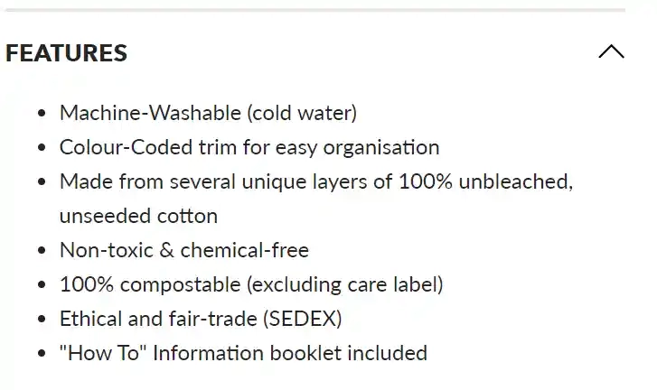
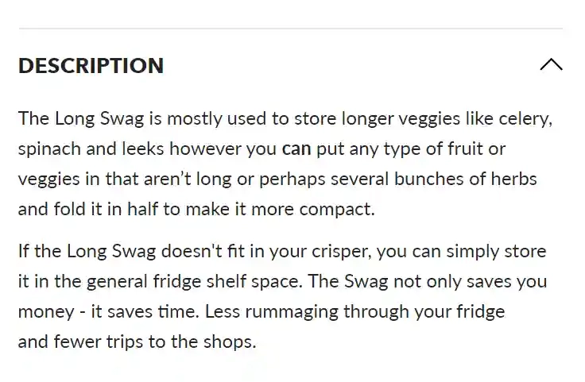
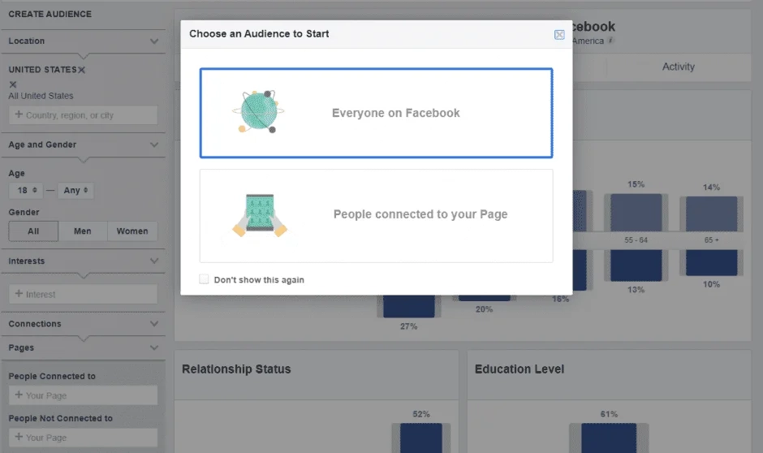

# 6步精准定位目标市场:从0到1的实战指南

---

创业路上最难的不是找钱,而是找对人——找到那群真正会为你的产品买单的人。很多老板烧了大把预算才发现:原来我的广告都投给了不会买的人。

这篇文章会教你用6个步骤锁定你的目标市场,让每一分营销预算都花在刀刃上。我会用真实品牌案例(耐克、网飞、乐高这些大牌怎么玩的)拆解给你看,顺便聊聊为什么说"所有人"从来不是你的目标客户。

---

## 先搞清楚什么是目标市场

目标市场就是:最有可能买你东西的那群人。

不是"可能会买"的,是"最有可能"的——这个区别很致命。他们有共同的特征:年龄段差不多、生活习惯类似、消费偏好重合。找到这群人,你的转化率能翻几倍。

往细了说,当你把这个群体缩小到个体层面,就得到了"理想客户"——那种你不用费劲说服、看到产品就想买的人。你要做的只是让他看见你的店铺。

所以别怕把范围定得太窄。精准定位不是限制生意,而是让营销预算发挥最大效果。

## 第一步:先理解你的细分市场

你卖的东西,总有一小撮人特别需要它。这就是你的细分市场。

看看你的产品或服务,问自己三个问题:

- 它解决了什么具体问题?
- 用户买它是为了摆脱什么麻烦?
- 它怎么让客户的生活变得更好?

举个例子:你卖保鲜袋。功能是"储存蔬菜",但真正的价值是"让菜保鲜更久,省钱又省心"。买你产品的人可能是注重健康、讨厌食物浪费的家庭主妇。

这三个问题的答案会成为你后续所有分析的锚点。每次陷入细节时,回来看看这几个答案,不会跑偏。

配合Google Analytics、Facebook Insights这些工具,你能更快摸清受众的真实需求。如果需要深入调研,问卷或焦点小组也是不错的选择。

## 第二步:研究你现有的客户

如果你已经有了一批付费客户,恭喜——你手里有一座金矿。

这些人已经用真金白银证明了:他们就是你的目标受众。现在要做的是分析他们的共性,然后去找更多类似的人。

看看这些维度:

**年龄段** - 主要客户几岁?这决定了你在社交媒体投广告时该选哪个年龄组。

**性别** - 男性居多还是女性?不同性别的需求点可能完全不同。

**收入水平** - 他们消费能力如何?是一次性大额购买,还是需要攒钱才能买?

**地理位置** - 客户住哪儿?时区是啥?当地有没有特殊的文化习惯?(比如你卖橄榄球装备,美国人和欧洲人理解的"football"压根不是一个东西)

**线上行为** - 他们常逛哪些网站?关注哪些品牌?爱看什么类型的内容?这能直接指导你的内容营销策略。

**生活方式** - 业余时间干嘛?有什么爱好?你的产品能不能支持他们的兴趣?

**价值观** - 他们在意什么?环保?性价比?这会影响他们的品牌忠诚度和购买决策。

大部分数据都能从Google Analytics、邮件营销后台或社交媒体分析工具里挖到。如果还缺一些信息,做个简短的购后调研问卷,配个折扣码鼓励填写,一举两得。

B2B领域的话,扫描客户名片录入CRM系统、用潜客挖掘工具丰富数据,都是常规操作。

## 第三步:深挖你的数据分析

投广告或做数字营销前,你得知道:什么内容能把人吸引到店铺,哪些内容能促成交易。

这些信息在你的网站或社交媒体分析后台里都能看到。数据会告诉你四种细分方式:

**人口统计细分** - 年龄、性别、种族、宗教、地点、收入、教育程度等。虽然看起来很枯燥,但投广告时超级有用。

**地理细分** - 受众住在哪里,决定了你发帖的时间、发邮件的时机,以及是否需要讨论地域性话题。

**行为细分** - 购买行为、使用频率、购买动机、品牌忠诚度等。这能帮你理解是什么驱使用户下单。

**心理细分** - 信念、价值观、态度、兴趣、生活方式等。这些因素会深刻影响购物行为。

市场细分听起来很学术,但其实就是为了精准投放广告,不浪费预算在不可能买你产品的人身上。

## 第四步:看看竞争对手在干什么

如果你还没有客户基础(或者即使有了),研究竞争对手也能帮你理清自己的客户画像。

去他们的网站、博客、社交媒体、广告里转转,试着搞清楚他们的目标市场策略。👉 [想安全高效地采集竞品数据?这个工具能帮你搞定](https://www.scraperapi.com/?fp_ref=coupons)

问自己这些问题:

- 能看出他们的细分策略吗?
- 谁是他们的理想客户?
- 他们的定价策略是什么?
- 他们有单一目标市场还是多个?为什么这么选?
- 他们怎么推广产品?用什么语言?强调哪些产品特点?
- 发帖频率如何?多久发一次或发一封邮件?

把自己伪装成他们的客户:订阅他们的邮件列表,关注他们的社交账号,亲身体验一下做他们客户的感觉。然后记笔记。

## 第五步:搞清楚产品特性和实际好处

这一步经常被忽略,但特别重要:搞明白用户为什么要买你的东西。

这发生在你确定了目标受众之后、开始触达他们之前。目的是在他们犹豫要不要买的时候,直接告诉他们:这产品能怎么改善你的生活。

营销圈常说的"产品特性vs产品好处"就是这个意思。特性是产品是什么、能干什么;好处是最终结果,以及它如何影响客户。

比如一个食物保鲜袋:

**特性**:可机洗、100%可降解、棉麻材质

**好处**:让蔬菜水果保鲜更久,省钱又省时间

当你展示产品如何让客户受益时,他们更可能下单——你的营销投入才算没白费。

如果你还不清楚自己产品的核心好处,现在就列个清单。把打算在Facebook和Instagram上推广的主打产品过一遍,写清楚每个产品能给买家带来什么具体好处。

这个过程不仅帮你卖货,还能帮你更精准地识别目标受众。还是那个保鲜袋的例子:如果产品能让果蔬保鲜更久,那目标客户很可能注重健康、在家做饭、关心食物浪费问题。

理解产品如何改善客户生活,就是在理解你的目标客户是谁。

## 第六步:用付费广告测试市场反应

前面的分析做完了,你对理想客户应该有清晰认知了。现在该跑广告测试了。

虽然SEO的投资回报率最高,但跑广告能快速出结果,还能积累大量测试数据。

Facebook广告管理工具可以同时在Facebook和Instagram投放广告。如果不知道从哪儿开始,可以先用Audience Insights把你的受众分析和真实的Facebook用户对比一下。

具体操作:根据你的分析创建自定义受众,然后针对同一产品做几个不同版本的广告。

或者反过来:用同一个广告测试不同的受众群体。

每个广告组投个5美元试试水,看看用户反应——是点击还是直接购买。

目标是不断测试广告和受众的组合,直到找到转化率(销售额)最高的那个配方。这个测试要定期做,每上新品都要测一轮。必要时重新做受众分析,确保你触达的是对的人。

## 13个品牌案例:看大牌怎么精准定位市场

来看看几个把目标市场分析玩明白的品牌。他们都找到了自己的理想客户,而且找得超级精准。

### 耐克:卖的不是鞋,是动力

耐克卖运动服、装备、鞋子和配件,目标客户是运动员和爱运动的人。产品质量好、耐用,价格自然不便宜——只有有闲钱的人才买得起。

但这还不是全部。他们专门瞄准年轻的aspiring运动员和跑步者——这两类人需要持续的激励来突破自己的极限。

所以耐克的营销广告都特别燃,能把人看哭那种。

### 网飞:跟着用户需求走

网飞的经验不在于他们的目标市场是谁(这一直在变),而在于他们接触目标市场的方式。

他们不停地研究受众,精准地给他们想要的东西。从邮寄DVD租赁到在线流媒体巨头,网飞一直在倾听用户,必要时就转型。

这么做的结果是:口碑营销自动帮他们带来销售。

### 乐高:产品给孩子,营销给家长

乐高是全球家喻户晓的品牌,原因很简单:虽然孩子玩玩具,但家长掏钱。

所以乐高的整个营销策略都围绕着取悦家长展开。不仅如此,乐高还和电影、游戏等有狂热粉丝的品牌合作,进一步巩固自己在孩子幻想世界里的地位。

理解了目标受众和购买障碍,乐高变成了数十亿美元的生意。

### Vans:拥抱非主流

Vans靠吸引叛逆者和不合群的人建立了自己的帝国。和网飞一样,这家公司学会了倾听市场——与其死守最初的愿景,不如跟着想买产品的人走。让目标市场引导自己,他们收获了极其忠诚的客户群。

### 迪奥:用"稀缺"做营销

迪奥是个高端品牌,靠高价和创新设计把自己区分开。定位如此小众,自然就找到了小众受众。

但真正让他们成功的不是独特的价值主张,而是他们营销自己为"稀缺品"的方式。理解了什么样的人会欣赏他们的产品,营销campaign就跟着这个调性走。

### Coachella音乐节:人人都能来,但hipster最爱

Coachella是个全类型音乐节,欢迎所有人。

而hipster(潮流青年)——那些以"独特"为荣的群体——最吃这一套。作为Coachella的主要市场,hipster为这个音乐节的营销铺了路。

品牌开始和H&M、YouTube等hipster常接触的品牌合作,进一步巩固在千禧一代潮人心中的地位,最终变成年入数百万美元的节日IP。

### Glossier:极简风美妆的崛起

Glossier是个美妆品牌,靠极简设计和天然妆感圈了一大波粉。目标市场是追求自然、轻松美妆流程的千禧一代。产品设计简单易用,强调提升而非遮盖天然美。

### Dollar Shave Club:用幽默卖剃须刀

Dollar Shave Club是个订阅制服务,每月送高质量剃须刀和护理产品到家。目标市场是想要方便、实惠解决剃须需求的男性。他们在营销里用幽默打动目标受众,积累了忠实粉丝。

### Fabletics:明星带货的运动装

Fabletics是Kate Hudson联合创立的订阅制运动装品牌。目标市场是想要时髦又实用、价格不贵的运动服的女性。他们用社交媒体网红触达目标受众,围绕品牌建立了强大的社区。

### Warby Parker:平价时髦眼镜

Warby Parker卖时尚、平价的眼镜和墨镜。目标市场是想要潮流眼镜但不想花大价钱的千禧一代。他们用社交媒体和口碑营销触达受众,建立了强烈的品牌认知。

### Chewy:宠物主人的一站式商城

Chewy是个电商品牌,卖宠物食品、玩具和配件。目标市场是追求便利和丰富选择的宠物主人。满49美元免费1-2天送达,客服24/7在线,解决宠物主的所有问题。

### Casper:盒装床垫的革命

Casper是个床垫品牌,用"盒装床垫"颠覆了传统行业。目标市场是想要方便、平价买床垫的人。100晚试睡期、免费配送和退货,帮他们积累了忠实用户和强大的品牌形象。

### REI:户外爱好者的精神家园

REI是个户外装备零售商,鼓励人们走出去探索。目标市场是需要高质量装备的户外爱好者。会员制提供专属折扣和活动,品牌使命就是激励人们拥抱户外。

## 别再拖了,现在就开始

作为电商创始人,明确目标受众能让你的定位更清晰。品牌调性、品牌故事、推荐营销、网红合作——所有营销渠道都需要你先搞清楚自己在和谁说话。

这篇文章的6个步骤提供了一个简单有效的框架。用客户画像、市场调研、客户反馈这些工具,你能更深入地理解受众,创造真正打动他们的个性化体验。

记住:👉 [目标市场不是一成不变的——随着业务增长和数据积累,要随时准备调整你的定位策略](https://www.scraperapi.com/?fp_ref=coupons)
